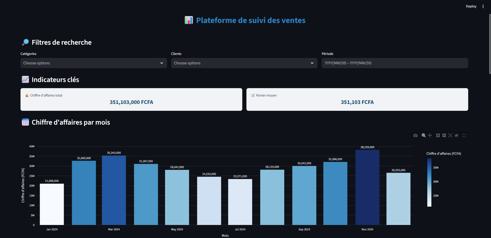
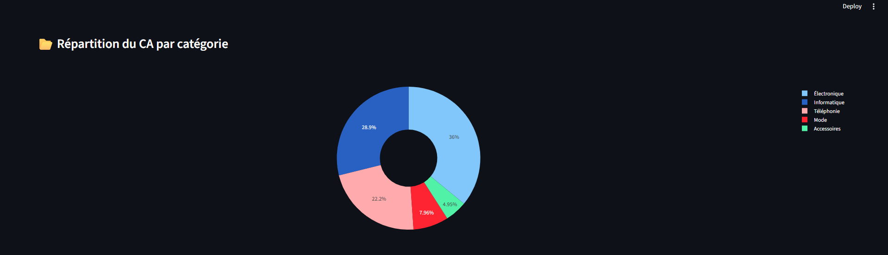
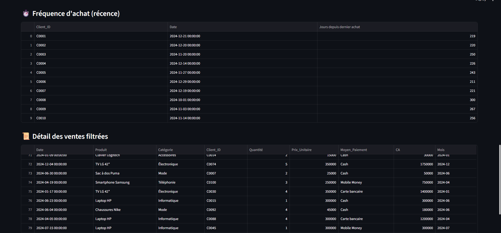
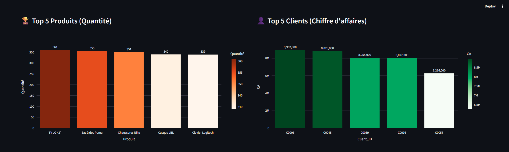

# plateforme-suivi-ventes

Ce projet est une application web interactive développée avec **Python (Streamlit)** pour suivre et analyser les ventes d’un commerce ou d’un site e-commerce.  
Elle permet de visualiser les **KPIs clés**, d’analyser les comportements clients et de générer des rapports téléchargeables.

---

##  Fonctionnalités

- **Filtres dynamiques** : par catégorie, client, période
- **Indicateurs clés (KPIs)** :
  -  Chiffre d'affaires total
  -  Panier moyen
  -  Top clients par chiffre d'affaires
  -  Top produits par quantité vendue
  -  Répartition du CA par catégorie
  -  Fréquence d'achat (récence)
- **Visualisations interactives (Plotly)** :
  - CA par mois
  - Graphiques en barres et en secteurs avec labels
- **Tableau détaillé des ventes filtrées**
- **Export CSV** des ventes filtrées

---

##  Aperçu du Dashboard

*(Insérer ici 2-3 captures d’écran)*  
Exemple :  

---

## 🔧 Technologies utilisées

- **Python** : Pandas, Plotly, Streamlit
- **Data** : CSV de ventes simulées (ventes sur 1 an)
- **Déploiement** : [Streamlit Cloud](https://share.streamlit.io)

---

Auteur

Ouattara Pogban Hervé Jean Didier
📧herve.ouattara@epitech.eu
🌍 LinkedIn

## 📂 Structure du projet

plateforme-suivi-ventes/
│
├── data/ # Jeu de données (ventes.csv)
├── scripts/ # Scripts Python
│ ├── app_streamlit.py # Application Streamlit
│ └── generer_dataset.py# Génération du dataset
│ └── generer_dataset.py# Génération du dataset
├── notebooks/ # Analyses exploratoires
├── analyse_ventes.ipynb/ # code du projet
├── requirements.txt
└── README.md